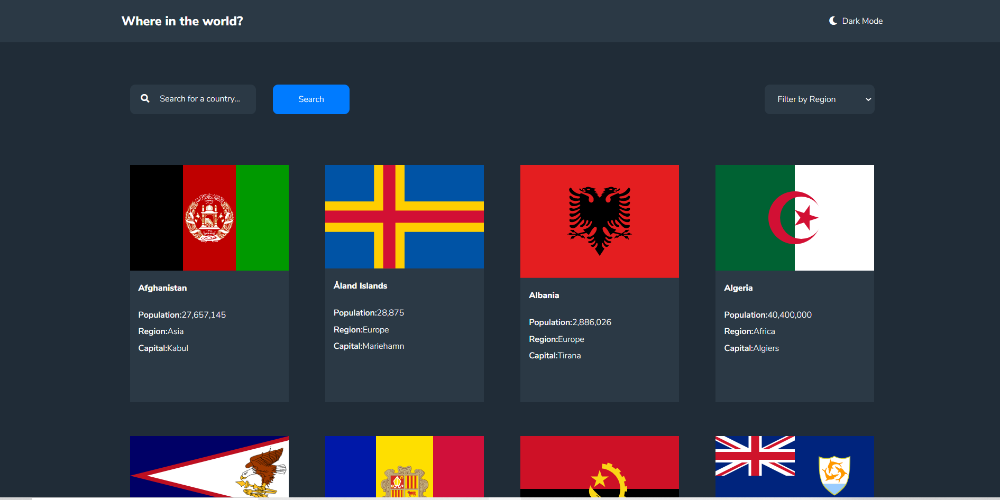
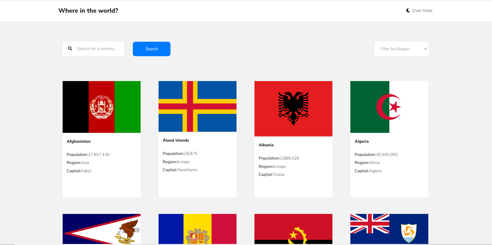
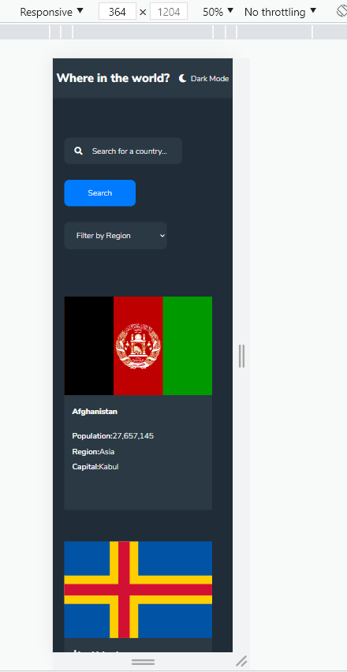
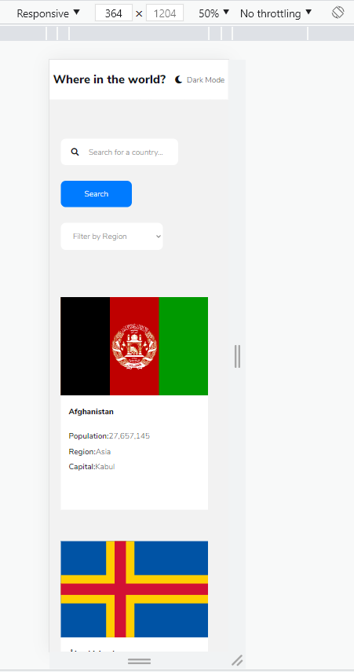

# Frontend Mentor - REST Countries API with color theme switcher solution

This is a solution to the [REST Countries API with color theme switcher challenge on Frontend Mentor](https://www.frontendmentor.io/challenges/rest-countries-api-with-color-theme-switcher-5cacc469fec04111f7b848ca). Frontend Mentor challenges help you improve your coding skills by building realistic projects. 

## Table of contents

- [Overview](#overview)
  - [The challenge](#the-challenge)
  - [Screenshot](#screenshot)
  - [Links](#links)
- [My process](#my-process)
  - [Built with](#built-with)
  - [What I learned](#what-i-learned)
  - [Continued development](#continued-development)
  - [Useful resources](#useful-resources)
- [Author](#author)

**Note: Delete this note and update the table of contents based on what sections you keep.**

## Overview

### The challenge

Users should be able to:

- See all countries from the API on the homepage
- Search for a country using an `input` field
- Filter countries by region
- Click on a country to see more detailed information on a separate page
- Click through to the border countries on the detail page
- Toggle the color scheme between light and dark mode *(optional)*

### Screenshot

### Screenshot






### Links

- Solution URL: [Add solution URL here](https://your-solution-url.com)
- Live Site URL: [Add live site URL here](https://your-live-site-url.com)

## My process


### What I learned

Had a hard time implementing the header containing the background of the header elements
```html
<h1>Where in the world?</h1>
```
and
```html
<div class="mode-container">
    <i class="mode-icon fas fa-moon"></i>
    <span class="current-theme">Dark Mode</span>
</div>
```

Fixed it by adjusting the @media query width and container widths

### Continued Development
- Need to optimize the search function
- Might add in pagination in future iteration of the project, perhaps lazy loading?
## Author

- Github - [arthsabino](https://github.com/arthsabino)
- Frontend Mentor - [@arthjosephsabino](https://www.frontendmentor.io/profile/arthjosephsabino)
